# Info

This is the template for your group project repo/report. We'll be setting up your repo and assigning you to it after the group forming activity. You can delete this info section, but please keep the rest of the repo structure intact.

You will be developing your game using [P5.js](https://p5js.org) a javascript library that provides you will all the tools you need to make your game. However, we won't be teaching you javascript, this is a chance for you and your team to learn a (friendly) new language and framework quickly, something you will almost certainly have to do with your summer project and in future. There is a lot of documentation online, you can start with:

- [P5.js tutorials](https://p5js.org/tutorials/) 
- [Coding Train P5.js](https://thecodingtrain.com/tracks/code-programming-with-p5-js) course - go here for enthusiastic video tutorials from Dan Shiffman (recommended!)

# FOR THE TREASURE

STRAPLINE. Add an exciting one sentence description of your game here.

IMAGE. Add an image of your game here, keep this updated with a snapshot of your latest development.

LINK. GAME LINK: https://uob-comsm0166.github.io/2026-group-24/

VIDEO. Include a demo video of your game here (you don't have to wait until the end, you can insert a work in progress video)

# Your Group

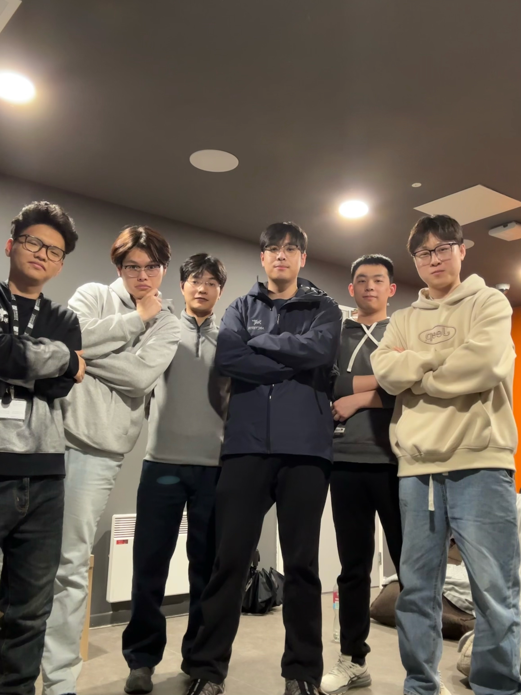

| Name | Username | Email | Role |
|------|----------|-------|------|
| Junjie Peng | JAY-bru | sg25291@bristol.ac.uk | Role |
| Songyun Han |  zhishihsy | bo24091@bristol.ac.uk | coder |
| Jian Ye | yejian414-tech | ok25241@bristol.ac.uk | Role |
| Junjian Cao | JulianC-2778 | nh25975@bristol.ac.uk | Role |
| Xiaoyu Zhao | zongshifei | rc25481@bristol.ac.uk | Role |
| Shangqing Li | shangqinglee123-create | pd25964@bristol.ac.uk | Role |

# Project Report

## 1 Introduction

For The Treasure is an adventure role-playing game that integrates roguelike mechanics with turn-based tactical combat. Players assemble a party of two heroes — selected from four distinct classes including the Knight, Wizard, Priest, and Ranger — each with a unique stat profile and weapon specialisation, before setting out to defeat enemies, resolve crises, and ultimately claim a legendary treasure.

The core gameplay is divided into two complementary pillars: hexagonal map exploration and turn-based combat. On the overworld, players navigate a procedurally structured hex grid under a strict turn limit, discovering randomised event tiles such as treasure chests, altars, merchant shops, and monster encounters. Items and weapons collected throughout exploration directly augment hero statistics, providing a meaningful sense of progression that carries into combat. The turn-based battle system is speed-driven: unit turn order is determined by Agility, and players must evaluate character stats, enemy attributes, and available skills to make optimal tactical decisions each round.

The game draws primary inspiration from For the King and Pokémon, adopting the former's overworld structure and resource management philosophy, and the latter's accessible yet strategic approach to turn-based combat. Weapons are class-specific and unlock unique skills upon equipping, while accessories and consumables offer flexible cross-class customisation, encouraging diverse build experimentation.

The defining innovation of For The Treasure lies in its deep integration of roguelike randomness. The game adheres to a single-life permadeath rule, and virtually every element — from item rarity rolls to enemy encounter generation — is governed by probability and dice mechanics. At the map level, the game employs a random seed system that sequentially constructs hexagonal terrain distribution, barrier placement, and event population based on the seed value, ensuring full map reproducibility while guaranteeing a distinct layout in every playthrough. This design fundamentally sustains long-term replayability and the desire to explore, making each run a genuinely unique adventure.

  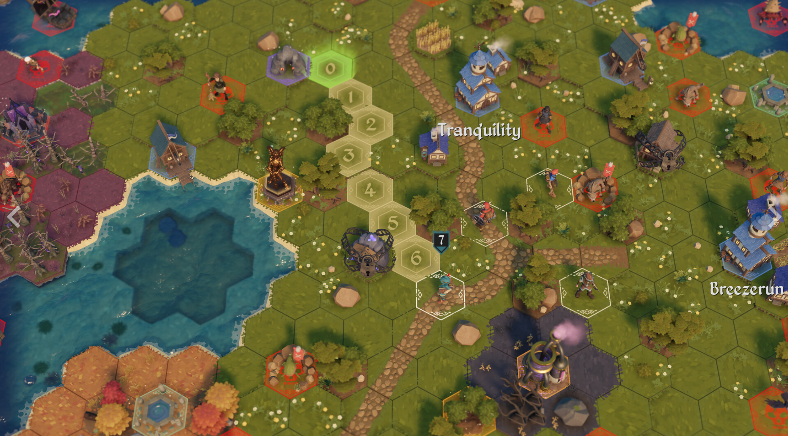 
  Figure 1.1: For the King

  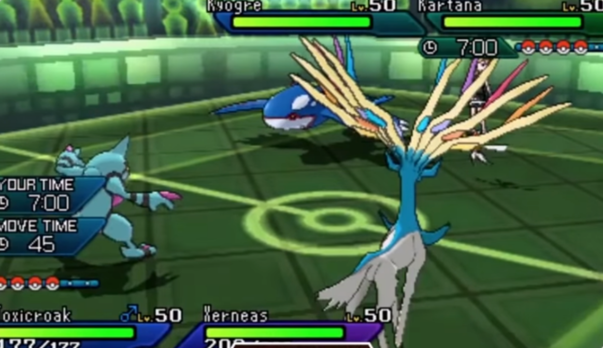 
  Figure 1.2: Pokémon

<table align="center">
  <tr>
    <td align="center">
      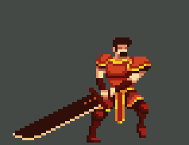 
      Figure 1.3: hero
    </td>
    <td align="center">
      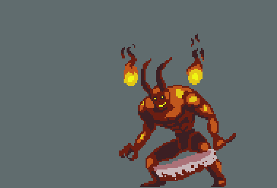 
      Figure 1.4: enemy
    </td>
  </tr>
  <tr>
    <td align="center">
       
      Figure 1.5: items
    </td>
    <td align="center">
      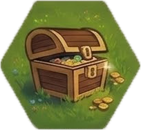 
      Figure 1.6: events
    </td>
  </tr>
</table>
## 2 Requirements

- 15% ~750 words
- Early stages design. Ideation process. How did you decide as a team what to develop? Use case diagrams, user stories. 
### Identifying Top-Level Needs with User Stories

## Epics, User Stories & Acceptance Criteria

<table>
  <thead>
    <tr>
      <th>Epic</th>
      <th>User Story</th>
      <th>Acceptance Criterion</th>
    </tr>
  </thead>
  <tbody>
    <tr>
      <td rowspan="2"><b>Map Exploration</b></td>
      <td>
        As a player, I want to move across a hexagonal tile map so that I can explore the world and discover new areas.
      </td>
      <td>
        Given the player selects a hex tile, when it is within the movement range, then the player moves to that tile and the remaining steps decrease accordingly.
      </td>
    </tr>
    <tr>
      <td>
        As a player, I want a limited number of steps per turn so that I must plan my movement strategically.
      </td>
      <td>
        Given the player has used all available steps, when they attempt to move further, then the action is blocked and a visual indicator shows that no steps remain.
      </td>
    </tr>
    <tr>
      <td rowspan="2"><b>Combat System</b></td>
      <td>
        As a player, I want to engage in turn-based combat so that I can defeat enemies through strategic decision-making.
      </td>
      <td>
        Given the player encounters an enemy, when combat begins, then both sides take turns performing actions until one side is defeated.
      </td>
    </tr>
    <tr>
      <td>
        As a player, I want to use a variety of skills and apply status effects so that I can devise diverse combat strategies.
      </td>
      <td>
        Given the player selects a skill during their turn, when the skill is used, then the corresponding effect (damage, buff, debuff, or status) is applied and reflected in the combat log.
      </td>
    </tr>
    <tr>
      <td rowspan="2"><b>Roguelite Mechanics</b></td>
      <td>
        As a player, I want my character to die permanently upon defeat so that each run feels meaningful and high-stakes.
      </td>
      <td>
        Given the player's HP reaches zero, when the defeat condition is triggered, then all progress for that run is lost and the player is returned to the start screen with no carry-over state.
      </td>
    </tr>
    <tr>
      <td>
        As a player, I want items and enemy encounters to be randomised each run so that every playthrough feels fresh and unpredictable.
      </td>
      <td>
        Given a new run begins, when the map and events are generated, then item drops and enemy placements are randomised so that no two runs follow the same pattern.
      </td>
    </tr>
    <tr>
      <td rowspan="2"><b>Equipment & Accessory System</b></td>
      <td>
        As a player, I want to collect a wide variety of class-specific equipment and accessories so that I can build a character suited to my playstyle.
      </td>
      <td>
        Given the player obtains a piece of equipment or accessory, when they open the inventory, then the item is displayed with its stats and any class restrictions clearly indicated.
      </td>
    </tr>
    <tr>
      <td>
        As a player, I want to freely mix and match equipment and accessories so that I can experiment with different build combinations.
      </td>
      <td>
        Given the player equips a combination of items, when the loadout is confirmed, then the combined stat bonuses and any synergy effects are calculated and displayed in real time.
      </td>
    </tr>
    <tr>
      <td rowspan="2"><b>UI & Feedback</b></td>
      <td>
        As a new player, I want an in-game tutorial so that I can learn the core mechanics without consulting external resources.
      </td>
      <td>
        Given the player launches the game for the first time, when the tutorial begins, then interactive prompts guide the player through movement, combat, and inventory step by step.
      </td>
    </tr>
    <tr>
      <td>
        As a player, I want to see the current turn count and active quest hints on screen so that I can track my progress at a glance.
      </td>
      <td>
        Given the player is in an active run, when a new turn begins or a quest objective updates, then the turn counter increments and the relevant quest hint is displayed in the HUD without obscuring gameplay.
      </td>
    </tr>
  </tbody>
</table>
## 3 Design

- 15% ~750 words
- System architecture. Class diagrams, behavioural diagrams.

### 3.1 Gameplay Flow Overview

  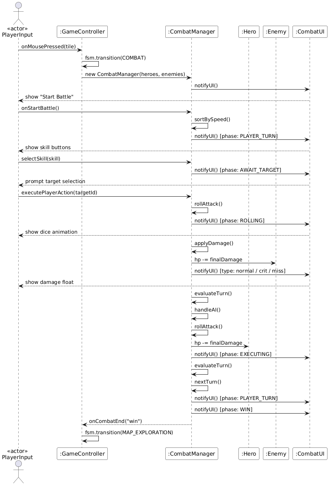

<b>Figure 3.1: Gameplay Flow Overview</b>

Figure 3.1 illustrates the sequence of interactions between key system objects during a single combat encounter. The diagram captures the collaboration between the `PlayerInput` actor, `GameController`, `CombatManager`, `Hero`, `Enemy`, and `CombatUI`.

The sequence begins when the player clicks on a monster tile, triggering the `GameController` to transition into the **COMBAT** state and initialise a new `CombatManager` instance with the current heroes and enemies. Once the player starts the battle, the `CombatManager` sorts all units by their speed stat to determine turn order.

On the player's turn, the `CombatUI` presents available skill buttons. The player selects a skill and a target, after which the `CombatManager` executes a dice roll to determine the outcome. The roll result, ranging from 1 to 6, maps to different damage multipliers:
- A roll of **1** results in a miss
- A roll of **6** delivers a perfect hit with double damage

The calculated damage is then applied to the `Enemy`, and the `CombatUI` displays a floating damage number to provide visual feedback.

Following the player's action, the `CombatManager` triggers the enemy AI, which selects a skill and attacks the `Hero`. After both sides have acted, `evaluateTurn()` checks whether all enemies are defeated or all heroes have fallen.

- **Victory** transitions the game back to `MAP_EXPLORATION`
- **Defeat** results in the game being reloaded

  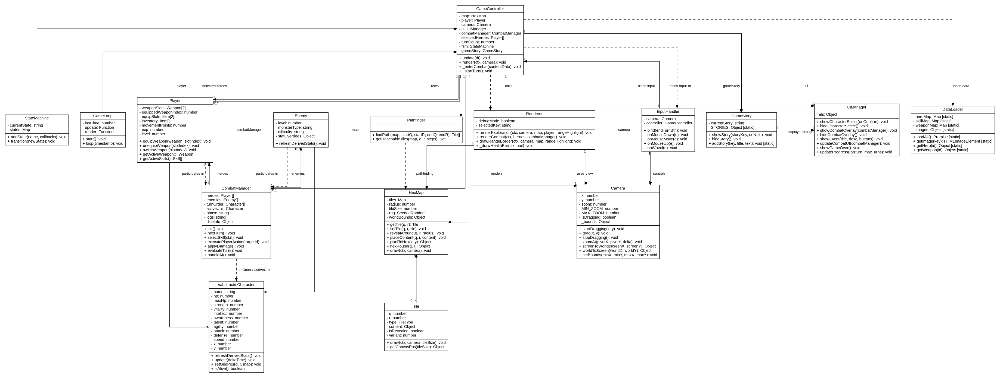

<b>Figure 3.2: Class Diagram</b>

| Class | Description | Key Responsibilities |
|-------|-------------|---------------------|
| GameController | Central control class | Holds all core component references, drives the state machine, and coordinates update() and render() each frame |
| StateMachine | Game state manager | Registers game states and handles transitions between character select, exploration, combat, and game over |
| GameLoop | Main loop driver | Calls update() and render() every frame via requestAnimationFrame to keep the game running continuously |
| Character | Abstract base class | Defines six core stats, calculates derived combat values, and provides shared methods for all character types |
| Player | Player character | Manages weapon slots, equipment, and inventory, and handles weapon switching and map movement |
| Enemy | Enemy unit | Scales stats by level and difficulty, and supports stat overrides for boss-type enemies |
| CombatManager | Combat flow controller | Generates turn order, handles player actions and enemy AI, and manages damage calculation and win/loss evaluation |
| HexMap | World map container | Stores hex grid data, generates terrain and events on initialisation, and provides tile queries and coordinate conversion |
| Tile | Single hex grid cell | Records terrain type, reveal state, and event content as the basic building block of the game world |
| Camera | Viewport controller | Supports panning and zooming, converts between screen and world coordinates, and enforces map boundaries |
| Pathfinder | Pathfinding utility | Implements A* to find the shortest movement path and calculates all reachable tiles within movement points |
| Renderer | Rendering utility | Draws the map, characters, health bars, and movement highlights for both exploration and combat scenes |
| UIManager | UI layer manager | Manages all interface screens including HUD, combat overlay, and event popups, bridging game logic and the DOM |
| DataLoader | Asset loader | Loads hero, skill, and weapon data alongside image assets at startup and caches them for runtime access |
| InputHandler | Input processor | Captures mouse and keyboard events and translates them into game commands for GameController |
| GameStory | Story display manager | Stores narrative content and triggers story screens at key moments throughout the game |

###   3.2 Final Class Diagram

 We adopt a modular, object-oriented architecture centered around the GameController, which precisely coordinates interactions between subsystems throughout the game's lifecycle via a finite state machine (StateMachine). The overall architecture divides the core logic into multiple highly decoupled, independent modules—including core scheduling (GameLoop), level and world management, an independent combat system, entity interactions, and resource management—thereby significantly enhancing the system's maintainability and scalability.
Operationally, the GameController maintains the overall macro game state (such as map exploration, story progression, and turn advancement) and dispatches module execution within the update loop.
Level and World Management: This is maintained by the underlying hexagonal grid system (HexMap) combined with a dynamic event system (EventTable). This module supports seamless transitions and independent state preservation for multi-tier map structures (e.g., Main World and Novice Village).
Combat and Entity System: The system strictly separates combat logic from map exploration logic. When an encounter is triggered, the state machine transitions control to an independent CombatManager. Acting as a sub-control center, this module manages the instantiation of friendly and hostile entities (Player and Enemy), coordinates turn phases, processes skills and stat calculations, and smoothly returns status feedback and loot settlement to the main controller after the battle concludes.
Resource and Presentation Management: The game's underlying configuration files (heroes, weapons, monster indices, etc.) are centrally loaded and persisted by the DataLoader; meanwhile, visual rendering (Renderer) and view interactions (UIManager) operate independently from the logic layer.
By decoupling exploration control, combat calculations, and resource loading from one another, the system not only ensures efficient and stable low-level operations but also gains tremendous flexibility in supporting complex multi-layer map structures and expanding deep combat mechanics.

  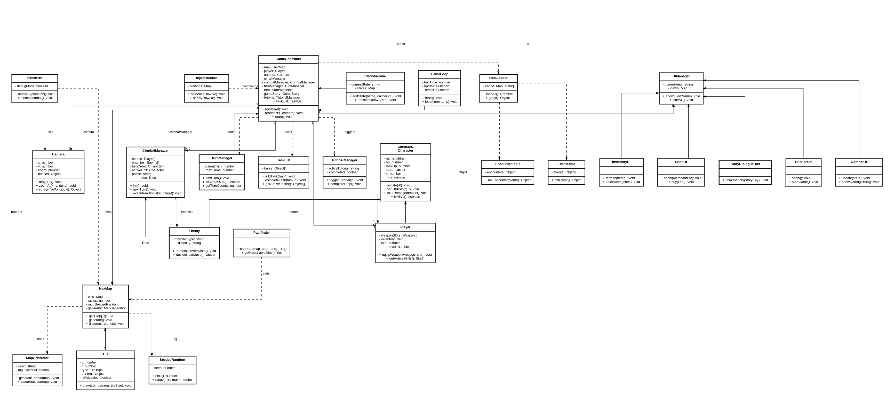

<b>Figure 3.3:New Class Diagram</b>

The main improvements to the system are reflected in the following three aspects.

Firstly, we have carried out the decomposition work for the design of the core control system. In the initial class diagram design, the GameController and CombatManager included a massive amount of mixed responsibilities. Now, the core logic is clearly defined and separated into specialized independent classes, which include TurnManager, Dice, TaskList, and TutorialManager. This improvement makes different kinds of game rules and lifecycle mechanics can be managed under a more modular and highly cohesive structure.

Secondly, we have made the improvement upon the structure of the world generation mechanism. Previously, the HexMap was responsible for both storing data and generating the map. Now, a dedicated MapGenerator has been extracted to handle procedural generation and entity placement. The HexMap strictly adopts the grid-based Tile structure for the representation of the map environment. Every Tile records its coordinate position (q, r), its type, and its content, thus supporting more fine-grained map control and rendering examination.

In the end, we have carried out a refactoring work on the User Interface (UI) interaction mechanism. In the beginning design stage, the UI logic was mainly processed in a unified way by a single monolithic UIManager. In the final design, this overly centralized structure has been got rid of, and the interface logic was distributed by us to specific UI component classes like CombatUI, InventoryUI, ShopUI, and StoryDialogueBox. When a specific interface needs to be shown, the system directly uses the UIManager as a router to manage the lifecycle of these independent views. This method lets the interface rendering logic be more clear, and therefore it decreases system coupling degree.

## 4 Implementation
### 4.1 Challenge 1: Hexagonal Grid Pathfinding System
One of the key challenges we faced was implementing a navigation system based on a hexagonal grid, enabling players to explore and move smoothly across large-scale maps. In the early stages of game design, we chose the hexagonal grid as the core map structure in order to provide more natural movement directions and more tactical path-planning possibilities. Because players frequently select target positions during gameplay, the system must compute paths and reachable ranges in real time. When the map size expands to hundreds of tiles, pathfinding calculations can easily become a runtime performance bottleneck. At the same time, the camera system must support panning, zooming, and coordinate transformation simultaneously. If these functions are not handled in a unified manner, mouse interactions may become inaccurate or visual jitter may occur.

The primary difficulty came from the performance limitations of the A* pathfinding algorithm. In the early implementation, the open set in Pathfinder.js was stored using a standard array. Each time a new node was inserted, the array was sorted to select the optimal node. This implementation resulted in a time complexity of O(n² log n) for a single pathfinding operation. As the map size increased, noticeable lag occurred when players selected distant targets, becoming the major runtime performance bottleneck. To address this issue, we redesigned the priority queue structure by implementing a custom MinHeap (binary minimum heap). This data structure sorts nodes according to their cumulative cost value (g-value), reducing the complexity of push and pop operations to O(log n). With the new implementation, the overall complexity of the A* algorithm was optimized to O(n log n), significantly improving pathfinding efficiency.

In addition, we optimized the logical rules of the pathfinding system. In the game, tiles containing events (such as treasure chests or shops) are allowed to serve as destination nodes but cannot be used as intermediate nodes in a path. This rule is implemented through the isPassable(tile, isGoal) function, where the Boolean parameter isGoal distinguishes between the destination and intermediate nodes. This ensures that the generated paths correctly follow the intended gameplay rules.

  <table align="center">
    <tr>
      <td align="center">
        
      </td>
      <td align="center">
        
      </td>
    </tr>
  </table>

### 4.2 Challenge 2: Multi-Layer Turn-Based Combat State Management System
Another major challenge was implementing a multi-layer turn-based combat state management system, designed to support complex combat interactions between multiple characters and enemies. In the game design, each unit can not only perform attacks and skills but may also be affected by multiple status effects, such as burn, freeze, poison, shield, and attack enhancement. Therefore, the system must be capable of managing multiple status effects simultaneously and executing their logic at the correct timing points.

Damage calculation in combat is not simply a matter of subtracting numerical values. Instead, multiple modifiers must be applied in a specific order, including equipment effects, buffs, debuffs, and triggered effects from special items. If these logical operations are not clearly structured, it can easily result in incorrect damage calculations or code that is difficult to maintain. Therefore, this challenge involved not only state management but also complex data flow design and modular extensibility.

The first major difficulty came from the unified representation and management of status effects. In CombatManager.js, each unit's status effects are stored within a statusEffects object, where the effect type serves as the key and the remaining number of turns serves as the value. For example, when the burn effect is applied, statusEffects.burn is set to 3, indicating that the effect will persist for the next three turns. Different status effects have different trigger timings. For instance, burn and poison deal damage at the start of a turn, freeze skips a unit's action, while some effects are triggered when the unit receives damage.

To avoid scattered conditional logic, we adopted a centralized management strategy. At the start of nextTurn(), the _tickStatus() function is called to process all status effects in a unified manner, including immediate damage, healing effects, and duration reduction. When adding a new status effect, developers only need to implement the corresponding logic within _applyStatus() and _tickStatus(), significantly reducing system maintenance complexity.

The second key difficulty arose from the complexity of the damage calculation logic. During combat, a single damage calculation requires multiple modifiers to be applied sequentially, and the order of execution directly affects the final result. In the _getIncomingDamage() function, we apply effects in a strictly defined sequence. For example, the system first checks the protective effect of the Star Cloak, which may completely block incoming damage if triggered. Next, damage amplification effects from Shockwave and Entangle are applied. Then, damage reduction provided 
by the Rock Shield is calculated. Finally, additional vulnerability effects provided by equipment are applied.

  

## 5 Evaluation

### 5.1 Qualitative Evaluation

To iteratively improve our game's mechanics, difficulty balance, and player enjoyment, we gathered qualitative feedback through two complementary methods: Think Aloud sessions and a Heuristic Evaluation.

#### 5.1.1 Think Aloud

##### 5.1.1.1 Process

Ten participants were invited to play the game while verbalising their thoughts in real time. Sessions were recorded and reviewed, with particular attention paid to moments of confusion, frustration, or engagement. The recurring themes were then organised into a thematic map (Figure 1), which guided our design iterations.

  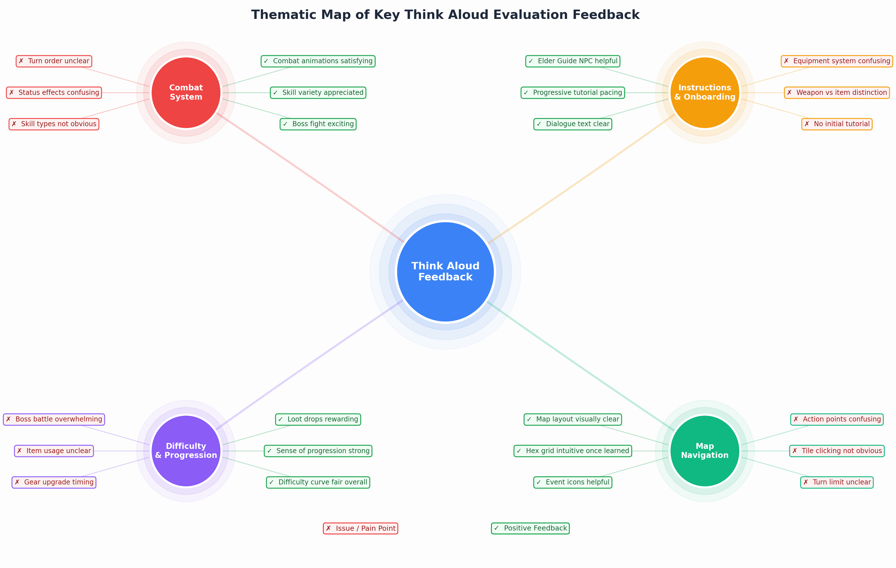
   
  <em>Figure 1: Thematic Map of Key Think Aloud Evaluation Feedback</em>

##### 5.1.1.2 Solutions and Adjustments

**Combat System:**
- **Issues:** Players struggled to follow the turn-based combat flow, especially regarding which unit would act next and how speed stats influenced turn ordering.
- **Solutions:** A turn order strip was introduced at the top of the combat screen, giving players a clear visual preview of the upcoming action sequence for both heroes and enemies.

**Instructions and Onboarding:**
- **Issues:** Many players entered the game with little understanding of core mechanics, particularly around equipment (weapon slot allocation, class-based restrictions) and the distinction between weapons and consumable items.
- **Solutions:** A step-by-step tutorial system was implemented via an Elder Guide NPC, who introduces each mechanic in sequence — covering combat, treasure chests, altars, merchants, and inventory management.

**Difficulty and Progression:**
- **Issues:** The boss encounter felt overwhelming, item usage during combat was unclear, and players were unsure when to swap out gear.
- **Solutions:** Visual status effect indicators (burn, poison, shield, etc.) were added beneath each unit, inventory tooltips were improved, and the enemy encounter table was rebalanced to create a more gradual difficulty ramp from early warrior enemies through to elite foes and the final boss.

**Map Navigation:**
- **Issues:** Players were unfamiliar with the action point system and did not realise that tiles were clickable to move.
- **Solutions:** A movement UI now clearly displays remaining action points, and the Elder Guide tutorial explicitly covers the movement mechanic before the player's first encounter.

#### 5.1.2 Heuristic Evaluation

##### 5.1.2.1 Process

Three evaluators played through the game and assessed it against Nielsen's 10 usability heuristics (Nielsen, 1994). This framework was chosen because our game relies heavily on menu navigation, inventory management, and combat UI — areas where these heuristics are particularly applicable. Each identified violation was rated by the team across three dimensions — impact, frequency, and persistence — to derive a composite severity score (Table 1). All violations were subsequently addressed.

<strong>Table 1</strong> Heuristic Violations, Severity Ratings, and Solutions

| Heuristic Violated | Issue Description | Impact (0–4) | Frequency (0–4) | Persistence (0–4) | Overall Severity | Solution |
|--------------------|-------------------|:------------:|:---------------:|:-----------------:|:----------------:|----------|
| Visibility of system status | No indicator of how many turns remain before the boss battle timer expires | 3 | 3 | 3 | 3.00 | A progress bar was added at the top of the screen displaying current turn vs. maximum turns, with a danger animation as the limit approaches |
| Visibility of system status | Status effects (burn, poison, shield) were not visibly communicated on affected units | 3 | 4 | 2 | 3.00 | Status effect icons with remaining duration counters now appear beneath each unit's health bar |
| Recognition rather than recall | Players had no quick reference for which skills were available based on the currently equipped weapon | 3 | 3 | 2 | 2.67 | A skill panel was added to the bottom of the combat screen, colour-coded by category (ATK, MAG, HEAL, BUFF, DEB), listing all available skills for the active hero |
| Flexibility and efficiency of use | Ending a turn required a mouse click each time; no keyboard shortcut existed | 2 | 4 | 3 | 3.00 | A Space bar shortcut was added to end the current turn on the map |
| Help and documentation | No introduction to combat or equipment mechanics was provided before the first encounter | 4 | 2 | 3 | 3.00 | A Novice Village tutorial area was created, where an Elder Guide NPC walks players through each mechanic before they encounter it in the game world |
| Error prevention | Players could mistakenly equip weapons incompatible with their class, consuming a turn with no benefit | 2 | 2 | 2 | 2.00 | Class-specific weapon restrictions were enforced, preventing incompatible items from being assigned to the wrong character |

### 5.2 Quantitative Evaluation

To measure both perceived workload and usability more rigorously, we administered two validated questionnaire instruments alongside statistical testing:
- **Raw NASA TLX** — to quantify perceived cognitive workload across difficulty modes
- **System Usability Scale (SUS)** — to assess overall interface usability
- **Wilcoxon Signed-Rank Test** — to determine whether observed differences were statistically significant

#### 5.2.1 Process

Ten participants each played the game in both Easy and Hard difficulty modes (Kosch et al., 2023). Early sessions revealed that participants were unfamiliar with turn-based combat and equipment mechanics, so a short live demonstration was incorporated before testing. Following gameplay, participants completed both questionnaires. To mitigate learning effects, the order in which participants experienced each difficulty was counterbalanced.

#### 5.2.2 Raw NASA TLX

##### 5.2.2.1 Subscale Workload Scores

Median scores across all six NASA TLX subscales rose with difficulty (Table 2). The most pronounced increase was in Frustration, climbing from 25 (Easy) to 60 (Hard). Effort and Temporal Demand also showed substantial increases.

<strong>Table 2</strong> NASA TLX Subscale Median Scores (Easy vs Hard)

| Scale | Median (Easy) | Median (Hard) | Δ Median |
|-------|:-------------:|:-------------:|:--------:|
| Mental Demand | 30 | 55 | +25 |
| Physical Demand | 10 | 15 | +5 |
| Temporal Demand | 20 | 50 | +30 |
| Frustration | 25 | 60 | +35 |
| Effort | 30 | 55 | +25 |
| Performance | 60 | 75 | +15 |

##### 5.2.2.2 Overall Perceived Workload Scores

Every participant reported higher perceived workload under the harder difficulty setting (Figure 2). Counterbalancing the test order helped minimise the influence of learning effects on these results.

  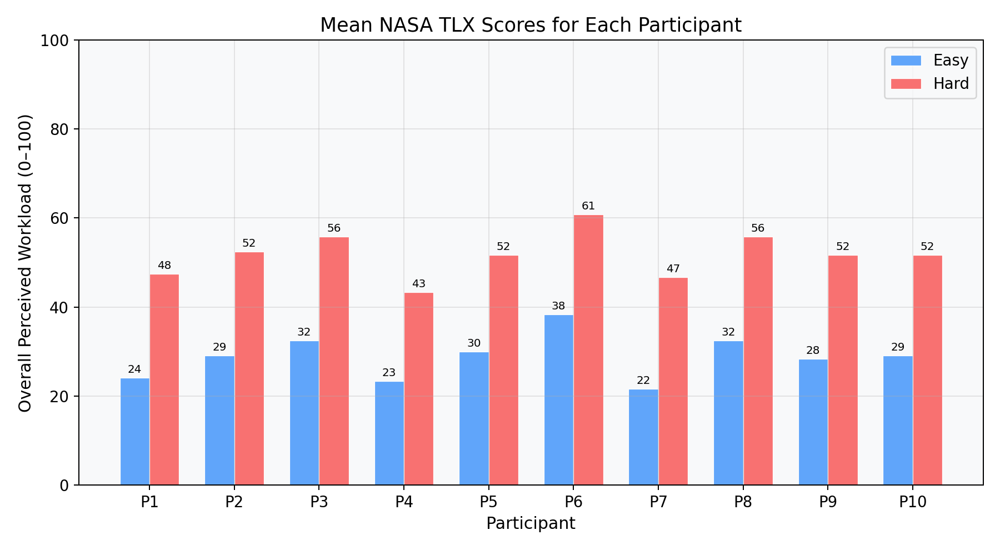
   
  <em>Figure 2: Mean NASA TLX Scores for Each Participant (Easy vs Hard)</em>

##### 5.2.2.3 Statistical Analysis

A Wilcoxon Signed-Rank test was applied at both the subscale and overall level to assess the significance of workload differences. As shown in Table 3, the overall workload increase was statistically significant, as were all individual subscales except Physical Demand.

<strong>Table 3</strong> Wilcoxon Signed-Rank Test Results for NASA TLX

| Scale | W Test Statistic | Critical Value | Statistical Significance |
|-------|:----------------:|:--------------:|:------------------------:|
| Mental Demand | 3 | 8 | Yes |
| Physical Demand | 12 | 8 | No |
| Temporal Demand | 1 | 8 | Yes |
| Frustration | 2 | 8 | Yes |
| Effort | 0 | 8 | Yes |
| Performance | 4 | 8 | Yes |
| Overall Perceived Workload | 0 | 8 | Yes |

##### 5.2.2.4 Solutions and Adjustments

Given that Hard difficulty produced statistically significant increases in Frustration, Temporal Demand, and Effort, we introduced several changes to preserve challenge without undermining player experience:
- Rebalanced the enemy encounter table so that difficulty scales more gradually in the early game.
- Introduced additional healing opportunities through altars and item drops to reduce perceived effort.
- Added clearer boss battle warnings and a visible turn countdown, giving players time to plan ahead and reducing time pressure.
- Improved Hard difficulty loot drops so that increased challenge feels rewarding rather than punishing.

#### 5.2.3 System Usability Scale (SUS)

##### 5.2.3.1 Process

Immediately following the NASA TLX, all 10 participants completed the SUS — a standardised 10-question instrument for assessing system usability (Lewis, 2018). Scores were derived using the standard SUS calculation method.

##### 5.2.3.2 Raw Data

Individual question responses (on a 1–5 Likert scale) and calculated SUS scores for each participant are presented in Tables 4 and 5 below.

<strong>Table 4</strong> Raw SUS Questionnaire Responses (Easy Difficulty)

| Participant | Q1 | Q2 | Q3 | Q4 | Q5 | Q6 | Q7 | Q8 | Q9 | Q10 | SUS Score |
|:-----------:|:--:|:--:|:--:|:--:|:--:|:--:|:--:|:--:|:--:|:---:|:---------:|
| P1 | 3 | 4 | 3 | 3 | 3 | 2 | 4 | 4 | 3 | 5 | 45.0 |
| P2 | 3 | 2 | 3 | 4 | 4 | 3 | 4 | 1 | 3 | 4 | 57.5 |
| P3 | 4 | 3 | 2 | 4 | 4 | 2 | 4 | 2 | 4 | 5 | 55.0 |
| P4 | 2 | 3 | 2 | 4 | 4 | 3 | 4 | 2 | 4 | 5 | 47.5 |
| P5 | 4 | 2 | 4 | 2 | 4 | 3 | 4 | 2 | 4 | 5 | 65.0 |
| P6 | 5 | 2 | 4 | 2 | 4 | 3 | 5 | 3 | 5 | 2 | 77.5 |
| P7 | 4 | 1 | 4 | 1 | 5 | 2 | 4 | 2 | 4 | 2 | 82.5 |
| P8 | 4 | 2 | 5 | 1 | 4 | 1 | 5 | 1 | 5 | 2 | 90.0 |
| P9 | 5 | 1 | 4 | 2 | 5 | 1 | 5 | 1 | 5 | 1 | 95.0 |
| P10 | 4 | 2 | 4 | 2 | 4 | 2 | 4 | 2 | 5 | 2 | 77.5 |

<strong>Table 5</strong> Raw SUS Questionnaire Responses (Hard Difficulty)

| Participant | Q1 | Q2 | Q3 | Q4 | Q5 | Q6 | Q7 | Q8 | Q9 | Q10 | SUS Score |
|:-----------:|:--:|:--:|:--:|:--:|:--:|:--:|:--:|:--:|:--:|:---:|:---------:|
| P1 | 2 | 4 | 2 | 4 | 3 | 3 | 3 | 4 | 2 | 5 | 30.0 |
| P2 | 3 | 3 | 2 | 4 | 3 | 3 | 3 | 2 | 3 | 4 | 45.0 |
| P3 | 3 | 3 | 3 | 4 | 3 | 3 | 3 | 3 | 3 | 4 | 45.0 |
| P4 | 2 | 3 | 2 | 4 | 3 | 3 | 3 | 3 | 3 | 4 | 40.0 |
| P5 | 3 | 2 | 3 | 3 | 4 | 3 | 3 | 2 | 4 | 4 | 57.5 |
| P6 | 4 | 2 | 4 | 2 | 4 | 2 | 4 | 2 | 4 | 3 | 72.5 |
| P7 | 3 | 2 | 3 | 2 | 4 | 2 | 4 | 2 | 4 | 3 | 67.5 |
| P8 | 4 | 2 | 4 | 2 | 4 | 2 | 4 | 2 | 4 | 2 | 75.0 |
| P9 | 4 | 1 | 4 | 2 | 4 | 2 | 4 | 1 | 4 | 2 | 80.0 |
| P10 | 3 | 2 | 4 | 2 | 4 | 2 | 4 | 2 | 4 | 3 | 70.0 |

> **Note on SUS scoring:** Odd-numbered items (Q1, Q3, Q5, Q7, Q9) contribute (scale position − 1); even-numbered items (Q2, Q4, Q6, Q8, Q10) contribute (5 − scale position). The sum of all contributions is multiplied by 2.5 to yield a score between 0 and 100.

##### 5.2.3.3 Results

Individual SUS scores are plotted in Figure 3, with the industry-standard benchmark of 68 shown for reference.
- Mean SUS score (Easy) — **69.25**
- Mean SUS score (Hard) — **58.25**

  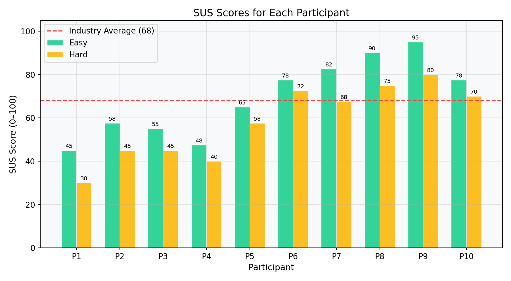
   
  <em>Figure 3: SUS Scores for Each Participant (Easy vs Hard)</em>

At Easy difficulty, scores broadly clustered around or above the 68 benchmark, indicating acceptable usability. Under Hard difficulty, several participants scored notably lower, suggesting that the increased enemy complexity and tighter turn constraints introduced meaningful usability friction.

##### 5.2.3.4 Statistical Analysis

A Wilcoxon Signed-Rank test on the paired SUS scores yielded a W statistic of 0 against a critical value of 8 (N = 10, α = 0.05), confirming a statistically significant difference in usability between the two difficulty settings.

##### 5.2.3.5 Solutions and Adjustments

The SUS results validated our qualitative and NASA TLX findings by confirming that Hard difficulty introduced usability friction not present in Easy mode. We found the SUS somewhat less actionable than the other instruments for identifying specific design changes, though it was valuable for confirming the overall pattern. We also noted a risk of questionnaire fatigue from administering both instruments in the same session — in future studies, we would separate the two evaluations or introduce breaks between them. Based on these findings, we prioritised:
- Streamlining the Hard difficulty combat UI to lower cognitive demands during play.
- Adding in-combat tooltips to make enemy abilities and status effects more transparent.
- Refining the inventory management flow to reduce time spent navigating menus mid-encounter.

## 6 Testing

### 6.1 White Box Testing

Jest unit tests were used to verify the correctness of our game's internal logic, focusing on state transitions — confirming that function calls produced expected changes in game state. Given the complexity of the turn-based combat system and the variety of status effect interactions, this required careful scoping. We prioritised testing the classes and methods governing combat mechanics, status effect processing, and encounter generation, as these had the greatest potential to affect gameplay correctness. Jest mocking was used extensively to construct controlled, reproducible game states.

**Example — Status Effect Testing:** Our game includes multiple status effects (burn, poison, shield, heal aura) that apply at the start of each unit's turn. We verified their application, stacking behaviour, and expiry using a suite of assertions, facilitated by the modular design of the `CombatManager` class. A representative excerpt is shown below.

**Example — Encounter Table Testing:** We also validated the encounter generation system, confirming that the correct enemy compositions spawn at each difficulty tier.

### 6.2 Black Box Testing

Extensive black box testing was carried out throughout the development cycle. A dedicated `develop` branch was used to consolidate and test feature merges before they were promoted to the `main` branch. Particular focus was given to edge cases in combat (e.g. simultaneous status effects, zero-HP transitions, boss phase changes) and map generation (verifying that all tile types rendered correctly and that events fired as expected).
## 7 Process
[this is our kanboard](https://caojunjian2025.atlassian.net/jira/software/projects/KAN/boards/1)

Our team adopted a hybrid collaboration model combining both online and offline working modes, which proved to be highly flexible and allowed us to identify and resolve issues in a timely manner throughout the development process.

### 7.1 Online Collaboration

* The backbone of our online communication was a weekly team meeting held via a voice channel application called OOPZ. These regular sessions gave every member a dedicated space to share their individual progress, discuss blockers they had encountered, and evaluate the work completed since the previous meeting. Crucially, they also served as a forum for constructive peer feedback — members could propose improvements to each other's implementations and collectively agree on the priorities for the upcoming development phase. This rhythm of structured, recurring communication kept the entire team aligned and prevented misunderstandings from snowballing into larger problems.

   
  Figure 7.1: voice channel

* To complement our meetings, we adopted Jira as our Kanban management tool. After each meeting, individual tasks were broken down and placed onto the Kanban board, giving everyone a clear, at-a-glance view of their own responsibilities and those of their teammates. This transparency was invaluable: rather than relying on informal memory or fragmented chat messages, the board served as a single source of truth for the project's current state.

For version control, we followed a disciplined Git workflow: pull → edit → commit → push. We used IntelliJ IDEA as our primary development environment, which provided convenient built-in Git integration. Our agreed convention was to create a new branch for each feature or fix and only merge into the main branch after the changes had been reviewed and tested during a team meeting. This practice allowed members to browse each other's pre-written function stubs and interface definitions, making cross-module integration significantly smoother.

  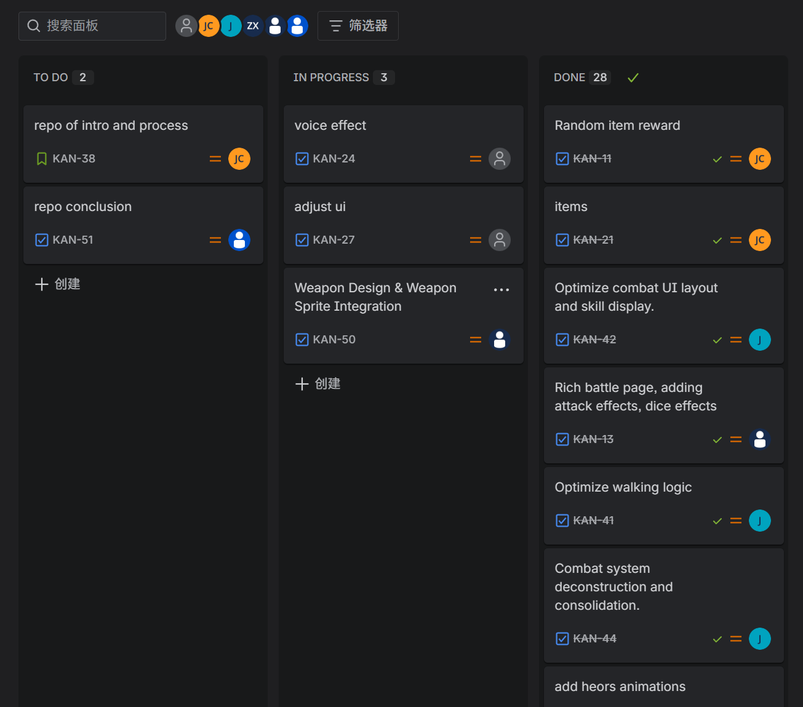 
  Figure 7.2: kanban

### 7.2 Offline Collaboration

Beyond our digital tools, we made full use of our scheduled in-person class time. Each week, team members brought their own laptops to the classroom, where we could discuss technical challenges face-to-face and engage in pair programming on the spot. This real-time, side-by-side collaboration proved especially effective for solving complex problems that were difficult to articulate through text or voice alone. Being physically present together created an energy and immediacy that online tools simply could not replicate.

### 7.3 Team Roles

Every member of our team was involved in programming work, which reflected the complexity and scope of the game we set out to build. Given the large number of functional modules required, we divided responsibilities roughly along the following lines: inventory system, combat system, map generation, event handling, finite state machine, and item data. However, it is worth emphasising that these modules were far from isolated — they were deeply interconnected. For instance, the item system fed into both the inventory and combat modules; the event system interacted with the map; and the state machine threaded through virtually every other component. As a result, clear inter-member communication and regular pair programming were not merely helpful, but essential.

### 7.4 Challenges and How We Adapted

The tight coupling between modules created real difficulties, particularly in the early stages of the project. Our most persistent pain point was Git merge conflicts. When multiple members edited overlapping areas of the codebase simultaneously, merging branches into main often produced a tangled mess of conflicts that cost us significant time and frustration to resolve.

Recognising this as a structural problem rather than a one-off incident, we adapted our workflow. We introduced stricter branch ownership conventions so that overlapping edits were less likely to occur in the first place, and we made a point of communicating in real time — via Oopz online, or in person in the classroom or our shared accommodation — whenever two members were working on interdependent features. This meant that integration issues could be caught and negotiated before they ever reached the merge stage.

Looking back, the early turbulence with version control was genuinely challenging, but it pushed us to develop better habits and a more disciplined approach to collaboration. By the latter half of the project, our hybrid online-offline model had matured into a workflow that felt natural and efficient. More than the technical skills we developed, the experience strengthened our interpersonal relationships and built a genuine sense of mutual trust within the team — something we consider one of the most valuable outcomes of this project.

## 8 Sustainability, ethics and accessability

### Sustainability
Both designing and running digital games have environmental impacts. As a digital game, this project requires computers or devices to operate, which consumes electrical energy. Additionally, the game uses a continuous update and rendering loop mechanism. While this ensures smooth visuals and improves user experience, it also requires the processor to keep running, leading to increased energy consumption.

To address this issue, we implemented the browser's animation frame mechanism to control refresh frequency. This helps reduce unnecessary calculations and improves overall energy efficiency.

During development, the game uses a resource preloading system, which loads images and audio files at the start of the game instead of repeatedly accessing them during runtime. This improves performance while reducing unnecessary system workload and energy consumption.

Furthermore, this digital game partially replaces traditional board games, reducing reliance on physical materials. Traditional board games typically require:

Paper maps
Cards
Character sheets
Plastic tokens
Packaging materials

These materials consume natural resources such as paper and plastic during production and generate carbon emissions. In contrast, this game stores character information, skill data, and equipment data in JSON format, and displays maps and characters digitally on screen.

This digital approach:

Reduces the use of paper and plastic materials
Minimizes packaging waste
Lowers transportation-related emissions
Allows updates without reprinting materials
Reduces overall resource waste
#### 8.1

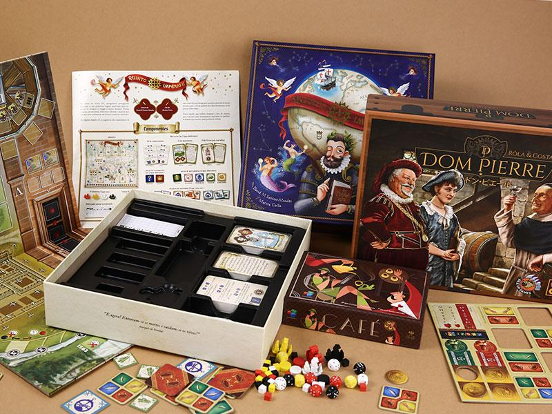

**Figure 1.** 

### Technical Impact

During the development process, we learned and applied several new technologies, demonstrating modular programming and system design principles commonly used in software engineering.

The game is primarily built using:

JavaScript
HTML
Canvas rendering technology

This combination allows the game to run directly in a browser without requiring additional software installation. As a result, the system has high compatibility and improved accessibility for users.

A modular design approach was used to structure the combat system. The combat management module handles:

Turn order management
Skill execution
Damage calculation

This structure ensures an organized combat flow and follows object-oriented programming principles, improving both code readability and maintainability.

Additionally, a resource management system was implemented to centrally load:

Character data
Skill data
Image resources

This unified resource management improves runtime efficiency, reduces redundant code, and increases overall system stability.
#### 8.2

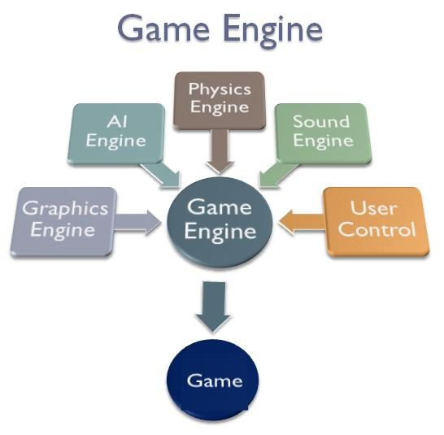

**Figure 2.** 

### Individual Impact

The game also has positive effects on players at an individual level.

During gameplay, players must:

Choose movement paths
Plan character actions
Select appropriate skills
Adapt strategies based on changing situations

These decision-making processes help develop:

Logical thinking skills
Problem-solving abilities
Strategic planning skills

Player comfort was also considered during the design process. To help relieve stress, the game includes multiple reward and feedback systems, providing players with:

A sense of achievement
Motivation to continue playing
Emotional satisfaction

This allows players to relax after studying or working, helping improve mood and overall well-being.
## 9 Conclusion

### 9.1 Project Reflection

Developing **For the Treasure** was a rewarding journey that challenged our technical and design capabilities alike. We are proud of the cohesive core gameplay loop we delivered: exploring procedurally populated hexagonal maps, managing a diverse party of four distinct hero classes — Knight, Wizard, Priest, and Ranger — and engaging in strategic turn-based combat enriched by a deep weapon system and status-effect mechanics. From unpredictable event encounters to challenging dungeon bosses, the variety keeps exploration consistently engaging, while the Novice Village tutorial and Elder Guide dialogue provide an accessible entry point for new players.

However, development required tough choices. Due to time constraints, features such as planned chapter expansions were scaled back. These compromises underscored the importance of scope management and maintaining a firm feature freeze. Ultimately, For the Treasure stands as a testament to our growth as developers. Building a feature-rich, playable RPG from the ground up remains a deeply satisfying achievement that reflects our ability to navigate complexity and shifting priorities under real-world constraints.

### 9.2 Lessons Learnt

By adopting an agile methodology supported by a Kanban board, we were able to identify and resolve issues within the same development cycle rather than deferring them. For instance, during playtesting, we discovered that combat damage values were severely unbalanced: certain skills could eliminate enemies in a single hit, stripping away all strategic tension. This was logged as a high-priority card and patched in the following sprint, preventing the imbalance from compounding as new systems were built atop the core combat loop.

Through think aloud testing sessions, we observed players verbalizing their confusion and expectations in real time, revealing friction points that internal testing had overlooked. These insights directly informed the design of the new player tutorial and the creation of "Elder Guide" dialogues, which contextualized complex mechanics within the game’s narrative. Consequently, players now navigate systems they once found unintuitive with noticeably greater confidence and independence.

### 9.3 Reflect on challenges

The development of **For the Treasure** was defined by two central technical challenges that tested our ability to maintain system integrity while scaling complexity:

* **Algorithmic Rigor**: Implementing a hexagonal grid using axial coordinates $(q, r)$ taught us the importance of mathematical precision. We realized that minor rounding errors in coordinate conversion could break immersion, requiring a robust cube-coordinate rounding trick to ensure stability. Furthermore, the evolution of our A* pathfinding from a simple array to a MinHeap priority queue underscored how critical data structure selection is for maintaining a consistent performance in a dynamic world.
* **State Management Sophistication**: Developing the multi-layered combat system taught us the necessity of logic decoupling and execution sequencing. We moved away from a simplistic "hit-and-subtract" damage model to a centralized modifier pipeline, where status effects (burn, shield, etc.) and equipment buffs are processed as distinct middleware layers. This transition forced us to implement a rigid trigger-based lifecycle—processing effects at precise moments like onTurnStart or onDamageReceive. This architectural shift not only prevented the "spaghetti code" typically caused by overlapping status effects but also ensured that complex interactions, such as damage reduction being applied before vulnerability multipliers, remained mathematically consistent and easily extensible for new skills.

These obstacles ultimately moved us away from nested conditional logic toward a more professional, hook-based StateMachine architecture, significantly improving the game's extensibility.
### 9.4 Future Work

#### 9.4.1 Immediate Next Steps

Our immediate goal is to focus on **refinement and content expansion**, transforming the existing demo into a more polished and complete experience.

* **Content Diversification:** We plan to introduce a wider variety of **items, enemies, and random events**. By adding items with unique **synergies** and enemies with distinct behavioral patterns, we aim to ensure that every adventure offers players a significantly different experience.
* **Numerical Balancing:** We will establish a more robust balancing framework to ensure the difficulty curve remains both challenging and fair. This will help prevent "power creep" from making the late-game tedious, while also avoiding excessive frustration in the early stages.
* **User Experience (UX) & Polish:** We aim to resolve remaining UI defects and **enhance the feedback**  (visual and audio) for player actions to improve the overall "game feel."

#### 9.4.2 Sequel

If given the opportunity to develop a sequel or an extended version of this project, our vision would be to expand this single-player demo into a **multiplayer online game**.

* **Immersive Narrative Systems:** Beyond simple random encounters, we would introduce a **dynamic faction system** or a "living world" concept, where player choices have long-term consequences on the game environment.
* **Technical Evolution:** We will re-engineer the core architecture to support **network synchronization for cooperative multiplayer**, enabling strategic, team-based gameplay.
## 10 Contribution Statement

- Provide a table of everyone's contribution, which *may* be used to weight individual grades. We expect that the contribution will be split evenly across team-members in most cases. Please let us know as soon as possible if there are any issues with teamwork as soon as they are apparent and we will do our best to help your team work harmoniously together.

| Team Member | Contribution |
|---|---|
| Junjie Peng | |
| Songyun Han |Game architecture design, State machine implementation, Map system, War fog, Auto-pathfinding & movable range display, Camera controls (drag & zoom), Randomised dice function, UI asset editing (assistance) |
| Jian Ye | |
| Junjian Cao | |
| Xiaoyu Zhao | |
| Shangqing Li | |

 

## 11 AI statement
Throughout this project, our team utilised AI tools in two specific areas to support our development process, while ensuring that all design decisions, logic, and overall implementation remained our own.

Firstly, we used AI assistance during the programming phase of the project. When implementing complex logic structures, such as state machines, we consulted AI tools to help generate initial code templates and suggest appropriate syntax. These outputs were not used directly; rather, they served as a starting point which our team then critically reviewed, modified, and integrated into our broader codebase. All architectural decisions, debugging, and final implementation were carried out by team members themselves.

Secondly, AI tools were used to assist with image editing during the UI development process. Specifically, we used AI-powered image editing tools to process and refine visual assets used in our interface, such as background removal, resizing, and style adjustments. The overall UI design, layout, and visual direction were conceived and executed by our team, with AI serving purely as an editing aid to improve efficiency.

In both cases, AI was used as a practical tool to reduce repetitive workload and improve the quality of specific outputs, rather than to replace our own thinking or decision-making. All core contributions — including system design, user interface planning, and project logic — reflect the independent work of our team members.

We believe our use of AI was responsible, transparent, and consistent with the spirit of the project requirements.
