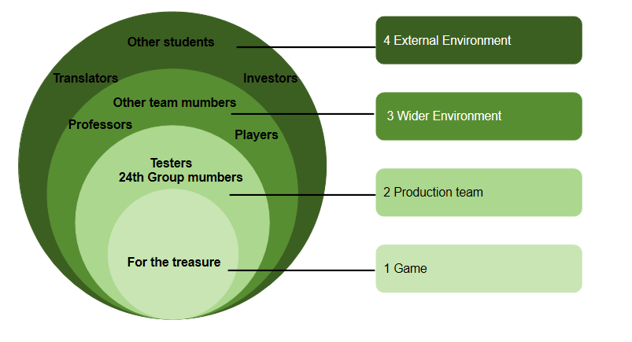

## Epcis and Userstories
## Stakeholders and User Stories

For stakeholders involved in the **FOR THE TREASURE** game, we have identified several target groups (Figure 1) and created user stories accordingly, categorising them into epics.

*Figure 1: Onion model diagram of stakeholders illustrating the four layers of engagement: Game, Production Team, Wider Environment, and External Environment.*

To ensure the game appeals to a diverse audience, we have defined a wide range of users. The following content details the specific epics, user stories, and acceptance criteria designed to meet these varied player needs.
## Stakeholders and User Stories

For stakeholders involved in the **Treasure Hunt** game, we have identified several target groups (Figure 1) and created user stories accordingly, categorising them into epics. 

*Figure 1: Stakeholder Map illustrating the four layers of engagement: Game, Production Team, Wider Environment, and External Environment.*

Here, we endeavour to encompass a broad and diverse range of user personas to maximise the game's appeal and meet the needs of the widest possible audience. These epics, along with their corresponding user stories and acceptance criteria.
### Epic 1: Dynamic Exploration & Randomized Loot
**User Story:** As a player who enjoys exploration, I want randomized treasure chests to appear on the map so that every session feels fresh and rewarding.

* **Acceptance Criteria:**
    * **Given** a level is being loaded, **when** the map generator runs, **then** the system must spawn treasure chests at random coordinates based on predefined spawn weights.
    * **Given** a player interacts with a chest, **when** the chest is opened, **then** the dropped items must correspond to the regional **Loot Table** (rarity/type).
    * **Given** a chest has been opened, **when** the items are collected, **then** the chest must be removed from the current map instance to prevent duplicate looting.

---

### Epic 2: Adaptive Difficulty Scaling
**User Story:** As a player, I want to manually adjust the difficulty level so that I can find the right balance between challenge and enjoyment based on my skill.

* **Acceptance Criteria:**
    * **Given** the pre-game settings menu, **when** the player selects a difficulty (e.g., Casual, Pro, Hardcore), **then** enemy HP, damage multipliers, and reaction speeds must scale accordingly.
    * **Given** an active session, **when** a player fails a specific challenge multiple times, **then** the system should suggest lowering the difficulty via a dynamic prompt.
    * **Given** a match ends, **when** rewards are calculated, **then** the score or drop rate must be adjusted based on the chosen difficulty coefficient.

---

### Epic 3: Terrain-Based Combat Effects
**User Story:** As a strategic player, I want different combat terrains (e.g., grass, sand, high ground) to influence character stats so that I can use the environment to my advantage.

* **Acceptance Criteria:**
    * **Given** a character is standing on specific terrain (e.g., Mud), **when** they attempt to move, **then** their movement speed must be reduced by a set percentage.
    * **Given** a character occupies "High Ground," **when** they perform a ranged attack, **then** they must receive a bonus to damage or accuracy.
    * **Given** a combat encounter starts, **when** the environment type is identified, **then** the physics and dodge rates must be modified by environmental modifiers.

---

### Epic 4: Dice-Based Combat & AI Focus-Fire Logic
**User Story:** As a tactical gamer, I want combat outcomes to be determined by dice rolls and face AI enemies that can coordinate "focus-fire" attacks against me.

* **Acceptance Criteria:**
    * **Given** an attack is initiated, **when** the resolution phase begins, **then** the system must simulate a dice roll where the final result is calculated as:
      $$\text{Total Score} = \text{Attribute} + \text{Dice Roll} \ge \text{Threshold}$$
    * **Given** multiple AI enemies are in range, **when** a high-priority target (e.g., low HP or closest player) is identified, **then** the AI must trigger a **Focus Fire** behavior to prioritize that target.
    * **Given** a hit or miss occurs, **when** the result is displayed, **then** the UI must show floating text indicating the dice roll value and the final damage dealt.

---

### Epic 5: World Seeds & Narrative-Driven Map Unlocks
**User Story:** As a player, I want to use Map Seeds to share specific worlds and unlock new regions by progressing through the main story.

* **Acceptance Criteria:**
    * **Given** the "New Game" screen, **when** a player enters a specific alphanumeric string (Seed), **then** the procedural generation must produce a map layout and resource distribution identical to that seed.
    * **Given** the World Map view, **when** a main story quest is incomplete, **then** the associated regions must remain "Locked" or under "Fog of War."
    * **Given** a core story milestone is achieved, **when** the quest is turned in, **then** the system must permanently unlock the new map area and update the player's save data.
